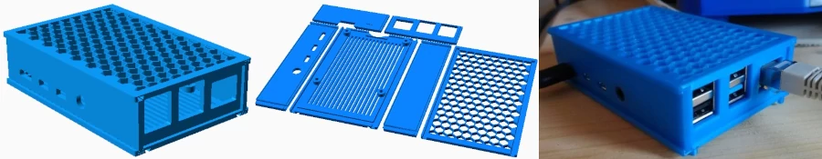
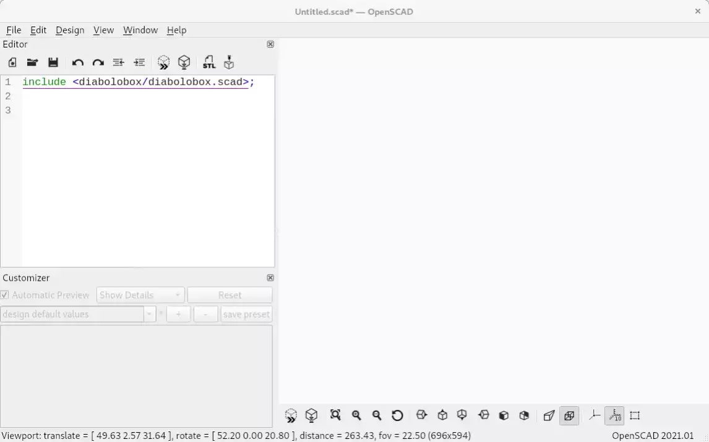

# Diabolobox

[](https://www.gnu.org/licenses/gpl-3.0)

Diabolobox is an [OpenSCAD](https://openscad.org/) box building library with 3D printing in mind.



* **no screw, no glue** needed !
* **flat printing** makes it easy to print and allows **complex** and **neat cuts** on any face of the box.
* **strong joints** with the dovetail-like diabolo shape.
* **scales very well** since everything is parametric. Want a micro box or a huge one ? You got it.
* **easy customization** through the OpenSCAD customizer and the panels modules.

## Built-ins
* the box has a **self-locking lid**.
* ready to use optional **vents** are available. Just diff them with the panel :
   ```openscad
   diabolize_lr("right")
   difference() {
     db_panel("left_right");
	 vents();
    }
	```	
* handy optional **feets**.
* optional **pillars** for printed circuit boards.

## How it works
A box is a set of six panels which are connected together with rails and slides.

The connector shape is a variation around the good old [dovetail joint](https://en.wikipedia.org/wiki/Dovetail_joint) (but it looks more like a diabolo, hence the name. Amazing, isn't it ?).


To get an easy print, the width of the rails matches the thickness of a panel. 

All dimensions are calculated from inner or outer dimensions of the finished box.

Each panel is generated individually and can be customized. 
A built-in assembled view is available to adjust settings in a visual and easy way.

## Installation
Just clone this repository to a [location](https://en.wikibooks.org/wiki/OpenSCAD_User_Manual/Libraries) where OpenSCAD will find it.
## Usage
Include the library in your work by using the well named `include` statement :
```openscad
include <diabolobox/diabolobox.scad>;
```
### Basic usage
To get a nice 42 x 84 x 21 box, just use the following code :

```openscad
include <diabolobox/diabolobox.scad>;

width = 42;      // size along X axis
depth = 84;      // size along Y axish
height = 21;     // size along Z axis
thickness = 3;   // panel thickness
flat = true;     // toggle between print-ready and assembled 3D view

plain_box();
```



Here are some other variable you can use:
```openscad
edge_offset   = 1.5;   // left/right panel offset for top and bottom edges
corner_radius = 1;     // rounded top and bottom angle. 0 to disable.
fit_clearance = 0.3;   // assembly tighteness
inner_dim     = true;  // are width, depth and height outer or inner lengths ?
```

### Advanced usage
You can of course have far more control on the box customization.

You can generate a blank panel with the `db_panel` module. 
A blank panel does not have the diabolo joint system attached to it. Why not ? Because this is a convenient way to add or substract volume to the panel without bother with calculating offset due to the diabolo and rails.

The connectors are added by applying a `diabolize_xx` module to the panel.

here is a example on how to cut circle in the middle of a side panel :

```
diabolize_lr("left")
difference() {
  db_panel("left_right");
  translate([od/2, ih/2, -0.01]) cylinder(d=2, h=th+0.02);
}
```
`od`, `ih` and `th` are variables you can use in your code.
They respectively stand for `outer depth`, `inner height` and `thickness`.

There some other variables like this, please refer to [the source code](diabolobox.scad) to get the list and usage. 


## Projects using diabolobox

I would be glad to add more projects here, feel free to add your own by editing this file and make a pull request.
* **[Diabolopi](https://github.com/ptitluc/diabolopi/)**: parametric Raspberry Pi cases.

## Contributing
 
The code is under GPLv3, fork it, modify it, use it, make pull requests and create issues !

## License
This is [GPLv3](https://www.gnu.org/licenses/gpl-3.0), please read the [LICENSE file](LICENSE).
 
